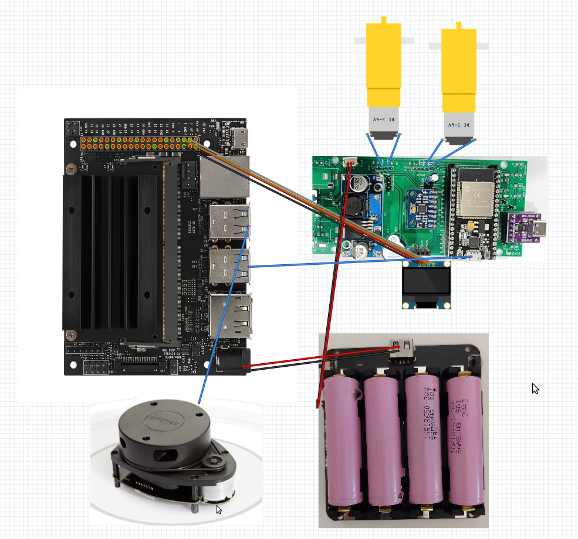
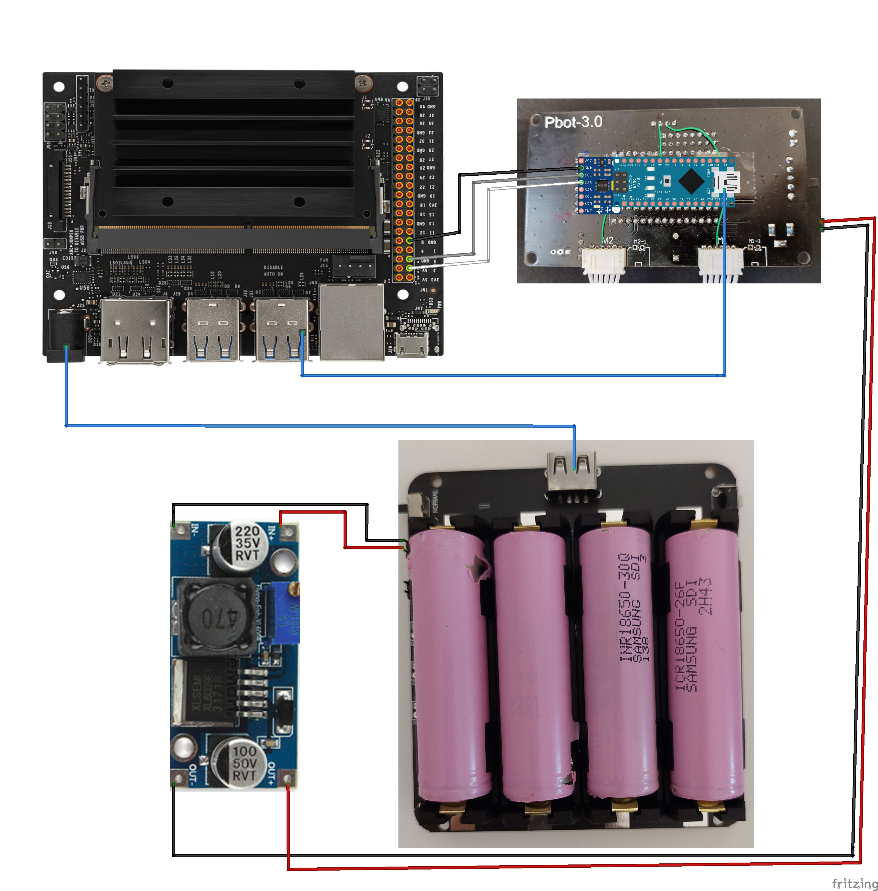

# Monicar2 DIY ROS navigation Robot
This project is about ROS Package for navigation with DIY robot  
Robot 3D model, BOM: Byungki  
Circuit: Byungki, ZETA7    
PCB layout: Byungki   
Aruduino/ESP32 scketch: ZETA7  
ROS code: ZETA7, Alpha, Byungki

# Especially Thanks
Automatic Addision: https://automaticaddison.com/how-to-set-up-the-ros-navigation-stack-on-a-robot/  
OMO R1 Mini: https://github.com/omorobot/omo_r1mini-foxy 
ROBOTIZ: https://github.com/ROBOTIS-GIT/turtlebot3  
Other Open Source sites   

### Monicar2, it uses ESP32 NodeMcu
```
ledBuzzer32Test.ino: Check LED, Buzzer   
encoder32Test.ino: Check encoder tick   
motorController32Test.ino: Check/Tune motor controller   
motorEncLed32Ros.ino: ROS implementation, motor control and LED     
motorEncLedMpu32Ros.ino: Please burn this for ROS navigation, motorEncLed32Ros.ino + MPU6050   
create_udev_rules_esp32snode.sh, delete_udev_rules_esp32snode.sh, esp32sNodemcu.rules: udev rule for ESP32    
create_udev_rules_rplidar.sh, delete_udev_rules_rplidar.sh, rplidar.rules: udev rule for RPLidar   
```
## Overview
<div align="center">
  
</div>

## Circuit Block Diagram

### Monicar II
<div align="center">
  
</div>

## Installation
Please download image from below location   
https://drive.google.com/file/d/1Jhr4SIeKLocHbJyeximI-j3mksZNgxN3/view?usp=drive_link

```bash
id: jetson
passwd: jetson
```
Please follow instruction on blow Notion(in Korean)   
https://zeta7.notion.site/Monicar-II-1ae110a410024d2291aba25e90d10875?pvs=4

### Clone source

```bash
  cd {$workspace_path}/src/
  git clone https://github.com/orocapangyo/monicar2.git
  git clone -b $ROS_DISTRO https://github.com/micro-ROS/micro_ros_setup.git
  git clone -b ros2 https://github.com/Slamtec/rplidar_ros.git
```

### Install dependency packages

Following additional packages may be reuqired to be installed.  
- ros-foxy-cartographer-ros ros-foxy-nav2-map-server \
- ros-foxy-rqt-robot-steering ros-foxy-imu-tools \
- ros-foxy-tf2-py ros-foxy-tf2-tools ros-foxy-nav2-bringup ros-foxy-navigation2
```bash
sudo apt install -y ros-foxy-cartographer-ros ros-foxy-nav2-map-server \
ros-foxy-rqt-robot-steering ros-foxy-imu-tools \
ros-foxy-tf2-py ros-foxy-tf2-tools ros-foxy-nav2-bringup ros-foxy-navigation2
```

### Build ROS2 source

- To build

```bash
  cd {$workspace_path}
  colcon build --symlink-install
```

- To enable the built source into ROS2 environment

```bash
  cd {$workspace_path}
  ./install/setup.bash
```

## Play with the robot

- To give authority for driver access to MCU and LiDAR

```bash
cd {$workspace_path}/src/monicar2/monicar2_arduino
./create_udev_rules_esp32snode.sh
./create_udev_rules_rplidar.sh
```

- To bringup robot

```bash
cd {$workspace_path}
ros2 launch monicar2_localization ekfPose4map.launch.py
```

- To teleoperate the robot using **KEYBOARD**

```bash
cd {$workspace_path}
ros2 run monicar2_teleop teleop_keyboard
```

- To conduct SLAM (Try after few seconds from MCU and LiDAR bringup)

```bash
cd {$workspace_path}
ros2 launch monicar2_cartographer cartographer.launch.py
ros2 launch monicar2_cartographer cartographer_rviz.launch.py
```

- Once mapping is done, you can create map.pgm and map.yaml file by executing

```bash
cd {$HOME}
ros2 run nav2_map_server map_saver_cli -f map
```

- To conduct path planning & following, close all previsous launch.py
```bash
cd {$workspace_path}
ros2 launch monicar2_localization ekfPose.launch.py
ros2 launch monicar2_navigation2 navigation2.launch.py map:=$HOME/map.yaml
ros2 launch monicar2_navigation2 navigation2_rviz.launch.py
```