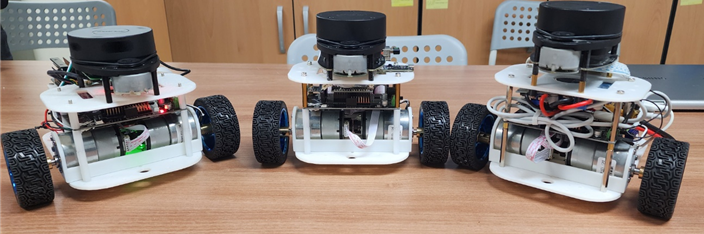
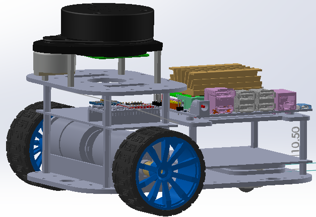

# Monicar II ROS navigation Robot
This project is about ROS Package for navigation with DIY robot  
Robot 3D model, BOM: Byungki  
Circuit: Byungki, ZETA7    
PCB layout: Byungki   
Aruduino/ESP32 scketch: ZETA7  
ROS code: ZETA7, Alpha, Byungki

## Tested System information

**Jetson Nano 4GB/2GB + RPLidar + ESP32**
* Ubuntu 20.04
* ROS2 Galactic

## Packages with Brief Explanation

```
├── monicar2_bringup      => robot bringup, start uROS, RPLidar, IMU...
├── monicar2_cartographer => SLAM via cartographer
├── monicar2_description  => Show robot 
├── monicar2_imuconverter => Make /imu/data topic, issues static TF
├── monicar2_localization => issue odometry, make ekfPose
├── monicar2_navigation2  => ros2 navigation2
├── monicar2_telep        => teleop via keyboard, joystick(=gamepad)
├── arduino               => uROS on ESP32, udev rules, motor tester
(...)
├── 
├── Images
├── LICENSE
├── README.md
```
# Especially Thanks
Automatic Addision: https://automaticaddison.com/how-to-set-up-the-ros-navigation-stack-on-a-robot/  
OMO R1 Mini: https://github.com/omorobot/omo_r1mini-foxy    
ROBOTIZ: https://github.com/ROBOTIS-GIT/turtlebot3       
Other Open Source sites   

### Monicar2, it uses ESP32 NodeMcu
```
ledBuzzer32Test.ino: Check LED, Buzzer   
encoder32Test.ino: Check encoder tick   
motorController32Test.ino: Check/Tune motor controller   
motorEncLed32Ros.ino: ROS implementation, motor control and LED     
motorEncLedMpu32Ros.ino: Please burn this for ROS navigation, motorEncLed32Ros.ino + MPU6050   
create_udev_rules_esp32snode.sh, delete_udev_rules_esp32snode.sh, esp32sNodemcu.rules: udev rule for ESP32    
create_udev_rules_rplidar.sh, delete_udev_rules_rplidar.sh, rplidar.rules: udev rule for RPLidar   
```

## Overview   
 <div align="center">
     
     
</div>

## Diagram   
<div align="center">
     
</div>

## Installation
Please download image from below location   
https://drive.google.com/file/d/1Jhr4SIeKLocHbJyeximI-j3mksZNgxN3/view?usp=drive_link

```bash
id: jetson
passwd: jetson
```
Please follow instruction on blow Notion(in Korean)   
https://zeta7.notion.site/Monicar-II-1ae110a410024d2291aba25e90d10875?pvs=4

### Clone source

```bash
  cd {$workspace_path}/src/
  git clone https://github.com/orocapangyo/monicar2.git
  git clone -b $ROS_DISTRO https://github.com/micro-ROS/micro_ros_setup.git
  git clone -b ros2 https://github.com/Slamtec/rplidar_ros.git
```

### Install dependency packages

Following additional packages may be reuqired to be installed.  
- ros-galactic-cartographer-ros ros-galactic-nav2-map-server 
- ros-galactic-rqt-robot-steering ros-galactic-imu-tools 
- ros-galactic-tf2-py ros-galactic-tf2-tools ros-galactic-nav2-bringup ros-galactic-navigation2
```bash
sudo apt install -y ros-galactic-cartographer-ros ros-galactic-nav2-map-server \
ros-galactic-rqt-robot-steering ros-galactic-imu-tools \
ros-galactic-tf2-py ros-galactic-tf2-tools ros-galactic-nav2-bringup ros-galactic-navigation2
```

### Build ROS2 source

- To build

```bash
  cd {$workspace_path}
  colcon build --symlink-install
```

- To enable the built source into ROS2 environment

```bash
  cd {$workspace_path}
  ./install/setup.bash
```

## Play with the robot

- To give authority for driver access to MCU and LiDAR

```bash
cd {$workspace_path}/src/monicar2/monicar2_arduino
./create_udev_rules_esp32snode.sh
./create_udev_rules_rplidar.sh
```

- To teleoperate the robot using **GAMEPAD**
```bash
cd {$workspace_path}
# jetson , terminal 1   
$ ros2 launch monicar2_bringup mcu.launch.py   
#jetson or pc terminal 2   
$ ros2 launch monicar2_teleop teleop_joy.launch.py   
```

- To teleoperate the robot using **KEYBOARD**

```bash
cd {$workspace_path}
# jetson , terminal 1
$ ros2 launch monicar2_bringup mcu.launch.py
#jetson or pc terminal 2
$ ros2 run monicar2_teleop teleop_keyboard
```

- To conduct SLAM (Try after few seconds from MCU and LiDAR bringup)
- Cartographer
```bash
cd {$workspace_path}
$ ros2 launch monicar2_localization ekfPose.launch.py 
# or using another options
# example) teleop_joy, not using description
$ ros2 launch monicar2_localization ekfPose.launch.py use_joy:='true' use_des:='false'

#terminal #2, recommand PC than Jetson
$ ros2 launch monicar2_cartographer cartographer.launch.py
#terminal #3, recommand PC than Jetson
$ ros2 launch monicar2_cartographer cartographer_rviz.launch.py
```
- Slam_toolbox
```bash
#terminal #1, Jetson
cd {$workspace_path}
$ ros2 launch monicar2_localization ekfPose.launch.py 
# or using another options
# example) teleop_joy, not using description
$ ros2 launch monicar2_localization ekfPose.launch.py use_joy:='true' use_des:='false'

#terminal #2,recommand PC than Jetson
$ ros2 launch nav2_bringup navigation_launch.py
#terminal #3,recommand PC than Jetson
$ ros2 launch slam_toolbox online_async_launch.py
#terminal #4, recommand PC than Jetson
$ ros2 launch monicar2_navigation2 slamtoolbox_rviz.launch.py
```

- Once mapping is done, you can create map.pgm and map.yaml file by executing

```bash
cd {$HOME}
ros2 run nav2_map_server map_saver_cli -f map
```

- To conduct path planning & following, close all previsous launch.py
```bash
#terminal #1, Jetson
cd {$workspace_path}
$ ros2 launch monicar2_localization ekfPose.launch.py initPose:='false'
# or using another options
# example) not using description
$ ros2 launch monicar2_localization ekfPose.launch.py initPose='false' use_des:='false'

#terminal #2,recommand PC than Jetson
$ ros2 launch monicar2_navigation2 navigation2.launch.py map:=./mymap.yaml
#terminal #3, recommand PC than Jetson
$ ros2 launch monicar2_navigation2 navigation2_rviz.launch.py
```
